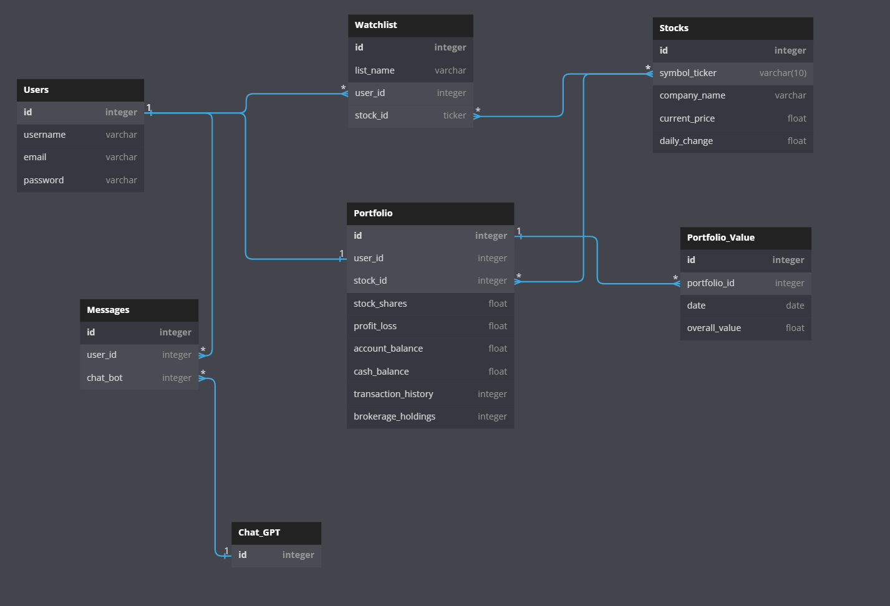

# Bootcamp Brokers

Bootcamp Brokers is a web app that helps users manage their portfolios, watchlists, and stay up-to-date with financial news, with the added bonus of a support bot for easy assistance.

[Check out the live site!](https://bootcampbrokers.onrender.com)

Contents
===
- [Feature List](#feature-list)
- [User Stories](#user-stories)

## Database Diagram

## Feature List
- **Users:**
  - Users can sign up, log in, and log out.
  - Users can log in as a demo user.
  - Users cannot utilize certain features of the application if not logged in.
  - Logged in users are automatically directed to their dashboard upon logging in.
- **Portfolio:**
  - Users can add stocks to their portfolio.
  - The portfolio displays the current/total account value(s)
  - Displays cash & brokerage holdings
  - Users can add or remove shares of stock currently held.
  - Users can remove stocks from their current holdings.
- **Watchlist:**
  - Logged in users can create, read, update, and delete their own watchlists.
  - Users can add and delete stocks from their watchlists.
  - Users can change the order of watchlists displayed.
- **Stocks:**
  - Fetch stock data using an external API

## User Stories

### Sign up
- As an unregistered and unauthorized user, I want the ability to sign up for the website by utilizing a sign-up form.
  - When I am on the `sign-up` page:
    - I would like to be prompted to enter my first-name, last-name, username, email, and password in a well-formatted sign-up form.
    - I would like to be logged in upon successful sign-up so that I can access all of the site's features.
  - When I enter invalid data into the sign-up form:
    - I would like the form to show me which validations I've failed to meet.

### Login
- As a registered and unauthorized user, I would like to be able to log in by using a log in form.
  - When I am on the `/login` page:
    - I would like to be able to enter my email/password on a well-formatted login form.
    - I would like to be automatically logged in and directed to the home page upon successful log-in so that I have access to all of the website’s functionality
  - When I enter invalid data into the login form:
    - I would like the form to show me the validation errors that I failed to pass and repopulate my form with only my valid entries so that I can try again.

### Demo User
- As an unregistered and unauthorized user, I would like an easy to find and clear button that signifies the ability to visit the site as a guest without logging in or signing up.
  - When I am on the `/signup` or `/login` pages:
    - I can see and click a “Demo User” button that allows me to access the website as a normal user so I can access the website’s features without going through the process of signing up as a user.

### Dashboard
- When I am on the `/` page:
  - I would like to be directed to this page after successful login and signup.
  - As a logged in user, I would like to be able to see my current portfolio value as a main component and my watchlists on my right.
  - I am able to see a list of the most recent financial news with the ticker and price gain/loss.
  - I am able to search for stocks on a search bar on top.

### Stocks
- When I am a specific stock's details page `/stocks/:stockTicker`:
  - I am able to view a stock's price
  - I would like to have the options to purchase and sell a stock
  - I would like to be able to see details about a stock inluding Key Statistics, Summary, an About section of the stock, the most Recent News, Historical Financial Data, and Stock Price data.
  - I would like to have the ability to add the ticker to my watchlist on this page.

### Watchlist
- I would like to be able to navigate to any of my specific watchlists at /list/:listId
  - On this page, I would like to be able to view a list of stocks on the watchlist I selected.
  - I am able to see a list of all of my watchlists on the right.
  - I am able to see the price of the stock today.
  - I can see the percentage of gain/loss on that day.
  - I can see the market capitalization of the stock.

### Portfolio
- I am able to navigate to my portfolio through the route `/user/:userId/profile`:
  - I would like to see my account balance displayed clearly and in an easily visible position.
  - I would like to see my profit/loss statement in a colored format.
  - I can see details of my shares, account balance history, and brokerage holdings.

### Messaging [Bonus]
- I would like to be able to message a support bot that has a personality that fits the concept of BootcampBrokers.
  - The bot will be from the OpenAI API.
  - I would like to be able to get all of my current messages from `/user/:userId/messages`
  - I would like to be able to get a specific message at `/user/:userId/messages/:messageId`
