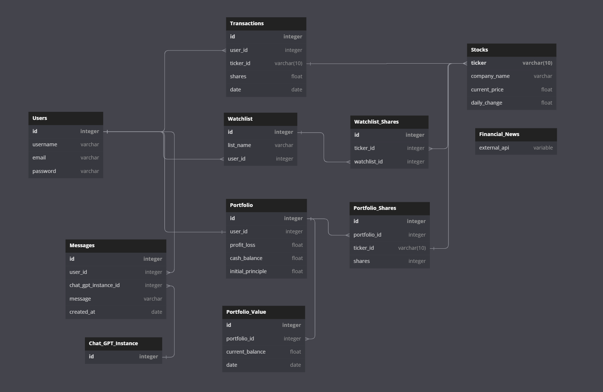

# Bootcamp Brokers

Bootcamp Brokers is a web app that helps users manage their portfolios, watchlists, and stay up-to-date with financial news, with the added bonus of a support bot for easy assistance.

[Check out the live site!](https://bootcampbrokers.onrender.com)

Contents
===
- [Database Diagram](#database-diagram)
- [Splash Page](#splash)
- [Login/Signup](#logging-in--signing-up)
- [Home Page](#home-page)
- [Support Bot](#context-aware-support-bot)
- [News](#news)
- [Stock Page](#individual-stock-page)
- [Watchlists](#watchlists)
- [Transaction History](#transaction-history)

## Database Diagram

## Splash

Upon landing on the website, users will see a visually enticing splash page with options to login or signup as well as the ability to access the site-wide support bot powered by ChatGPT 3.5 Turbo.

## Logging in / Signing Up

This beautiful login page introduces users to the level of design and streamlined data that can be expected from the rest of the website. See if you can spot the easter egg in the image!

Signing up is also an option from this page by simply clicking the "Create an account" link.

## Home Page

The key component of the home page is rich data visualization with an extraordinary level of functionality including live portfolio value tracking and up to date stock data which comes from an external API. All of the optional buttons provide the user with a different view, with the added feature of being able to deposit cash directly into your account.

## Context-Aware Support Bot

Powered by ChatGPT 3.5 Turbo, the intelligent support bot can answer all of the user's questions about the website. Its important to note that the user should not take any real financial advice from the bot or the website.

## News

Authentic real-time news pulled directly from the external API which users can click and be taken straight to the article of their choosing.

## Individual Stock Page

Users can see detailed data about an individual company's stocks with the ability to buy and sell stocks within the account's financial limitations. Remember, users can always add more money to your account on the home page!

This page also features the relevent portfolio transaction history and a list of news articles for the user to browse. Stocks can also be added to any number of watchlists from this page.

## Watchlists

Watchlists for the account can be easily accessed and managed by clicking a watchlist from the home page! From here, more detailed information about the companies' stocks can be seen. Stocks can also be added or removed from the watchlist on this page.

## Transaction History

Seeing the history of all transactions is an important feature for a user. By navigating to this page, the user can see all transactions that have occured from the very beginning of account creation.

